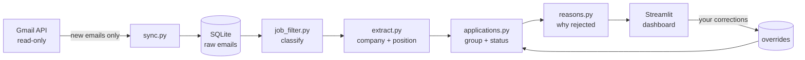

# JobsTracker 🌿

**A calm morning dashboard for a job search.** JobsTracker reads your Gmail (read-only), finds the
emails about your applications, groups them per company and position, and shows where everything
stands: what needs you today, who is still reading your CV, who went silent, and *why* companies
said no.


## Why I built it

While looking for an internship, my inbox mixed application confirmations, rejections, assessment
invitations, job alerts and newsletters. I felt I had sent "more than 100" applications. The real
number, once the tool counted them, was 48. It also showed that most replies arrived within 3 days
(a sign of automated CV screening), and that only a minority of rejections were actually about my
profile. A job search is easier to keep going when you see the facts instead of a feeling.

## Features

- **Gmail sync, read-only:** only new emails are downloaded on each run (incremental sync)
- **Email classification:** confirmation, rejection, assessment, interview (including AI
  interviews), offer, in English and French. Job alerts and newsletters are filtered out
- **Applications, not emails:** emails are grouped by company and position, even when one company
  writes from several addresses (e.g. `recruiting@jobalerts.company.com` and `company@myworkday.com`)
- **Statuses:** ✋ your turn · ⏳ waiting for them · 🎉 offer · 👻 ghosted (15+ days of silence) ·
  rejected · expired
- **Rejection reasons:** each rejection is sorted into a reason (other candidates, profile mismatch,
  eligibility, location, closed position, format, no reason given) with the exact sentence quoted
- **Manual corrections** in the dashboard, kept across every re-sync
- **Morning automation:** a Windows scheduled task syncs at 07:00, and the dashboard warns you if
  a sync failed


## How it works



One design rule runs through the project: **store the raw data, recompute everything derived
from it.** Raw emails are kept in SQLite. Categories, applications, statuses and reasons are
rebuilt from them on each sync, so improving a rule improves the whole history instantly, without
calling Gmail again (`python -m app.services.sync --reclassify`). Statuses depend on today's date
(an application becomes "ghosted" overnight), which is another reason to recompute rather than store.

## Privacy

- The Gmail permission is `gmail.readonly`: the app cannot send, delete or modify anything.
- Everything stays on your machine: emails are stored in a local SQLite file, nothing is uploaded.
- `client_secret.json`, `token.json`, the database and logs are all git-ignored.
- **Demo mode** runs on fictional companies, so the app can be shown without real emails.
  All screenshots in this README come from it.

## Quick start

Requires Python 3.11+.

```bash
python -m venv venv
venv\Scripts\activate          # macOS/Linux: source venv/bin/activate
pip install -r requirements.txt
```

### Try it with demo data (no Google account needed)

```powershell
$env:DEMO = "true"             # macOS/Linux: export DEMO=true
streamlit run dashboard.py
```

### Use it with your own Gmail

1. In the [Google Cloud Console](https://console.cloud.google.com/), create a project, enable the
   **Gmail API**, and create an OAuth client of type **Desktop app**. Add your address as a test user.
2. Download the client file as `client_secret.json` into this folder.
3. Run the first sync. A browser opens so you can log in to Google:
   ```bash
   python -m app.services.sync
   ```
4. Open the dashboard: `streamlit run dashboard.py`
5. Optional, Windows: sync automatically every morning at 07:00:
   ```powershell
   powershell -File scripts\install_morning_task.ps1
   ```

Settings (in a `.env` file or as environment variables): `USER_NAME`, `GHOST_DAYS` (default 15).

## Tests

```bash
pip install -r requirements-dev.txt
pytest
```

Most test cases come from real emails that the rules once got wrong. For example, *"If you are
not selected for this position..."* is a confirmation, not a rejection.

## Project structure

```
app/
  core/config.py          settings (paths, ghost delay, demo mode)
  db/database.py          SQLite schema, migrations, queries
  filters/job_filter.py   email classification rules
  filters/extract.py      company and position extraction
  filters/reasons.py      rejection reasons
  services/gmail.py       Gmail API: login, search, download
  services/sync.py        incremental sync (manual or scheduled)
  services/applications.py  grouping into applications, statuses
  demo.py                 fictional demo data
dashboard.py              Streamlit dashboard
scripts/                  Windows scheduled task installer
tests/                    pytest suite
```

## Tech stack

Python · Gmail API (OAuth 2.0) · SQLite · pandas · Streamlit · Altair · pytest

## Roadmap

- [ ] **ML classifier:** replace the hand-written rules with a scikit-learn model trained on
      labeled emails, and measure it against the rules (precision, recall, confusion matrix)
- [ ] **LLM extraction:** company, position and rejection reason extracted by a language model
- [ ] REST API with FastAPI
